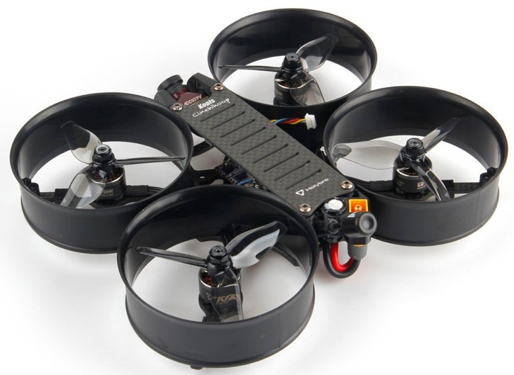
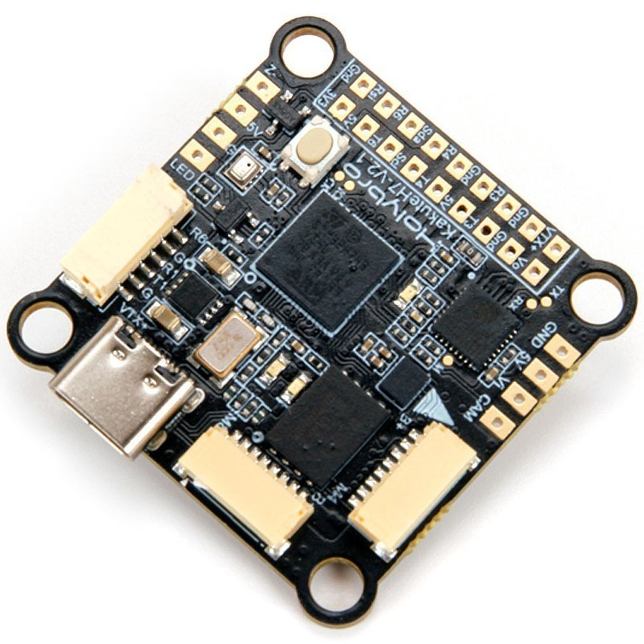

# Kopis CineWhoop3 - Setup
This repository describes the steps to setup the Kopis CineWhoop 3 for use in an indoor arena.

## The Holybro Kopis CineWhoop 3 quadrotor

The CineWhoop3 is a 3 inch FPV quadrotor that comes equipped with the Holybro Kakute H7 v2 flight controller, which is great because it suports the PX4-Autopilot.
This drone, due to its small size, is perfect to be used in indoor experiments that do not require an onboard computer or vision capabilities. It is appropriate, for example, to test multi-vehicle planning or control algorithms. Moreover, it provides an extra security for inexperienced users, due to its ducted propellers.



To learn more about this quadrotor and its specifications, consult the [Holybro website](https://shop.holybro.com/kopis-cinewhoopfree-shipping_p1196.html?).


## Installing PX4 autopilot on the Kakute H7 v2

The first step in setting up the drone for use in the arena, is to install the PX4-Autopilot on the Kakute H7 v2 flight controller. A special version prepared for use in this drone and indoor flight can be found at a [forked PX4 repository](https://github.com/ptrindade96/PX4-Autopilot-Kopis_Cinewhoop). However, a compiled version of the firmware is available in this repository, for ease of use.



### Ubuntu
To install it, begin by cloning this repository and installing some required dependencies, as follows:
```
git clone https://github.com/ptrindade96/KopisCineWhoop3-Setup.git --recursive
sudo apt install dfu-util
```
You will need to [install QGroundControl](https://docs.qgroundcontrol.com/master/en/getting_started/download_and_install.html).

Once this is done, use the following steps to install the bootloader:
1. Connect the board to your computer using a USB-C cable, while pushing the DFU button (the small button on top of the board).
2. Open a terminal on the folder with the cloned repository, and run the following command: ``` dfu-util -a 0 --dfuse-address 0x08000000:force:mass-erase:leave -D Compiled\ PX4-Autopilot/holybro_kakuteh7v2_bootloader.bin ``` The purpose of this command is to erase the board's flash and the install the bootloader. This will throw an error, because there is a part of the flash that can't be erased. Ignore it and proceed (do not close the terminal).
3. Disconnect the board and connect it again while pushing the DFU button.
4. Go back to the terminal and run the following command: ``` dfu-util -a 0 --dfuse-address 0x08000000 -D Compiled\ PX4-Autopilot/holybro_kakuteh7v2_bootloader.bin ``` Once it is finished, you can disconnect the board.

After installing the bootloader, you can proceed with installing the Firmaware. To do so, re-connect the board to your computer (it is no longer necessary to press the DFU button), and open QGroundControl. Proceed as indicated in the [documentation](https://docs.px4.io/main/en/config/firmware.html#installing-px4-master-beta-or-custom-firmware) to install custom PX4-Autopilot. When prompted to select a file, go to the repository and select the file __holybro_kakuteh7v2_default.px4__ in the folder _Compiled PX4-Autopilot_


## Connecting RC and WiFi radios
TODO

Use a spectrum radio with


## Printing antena support
